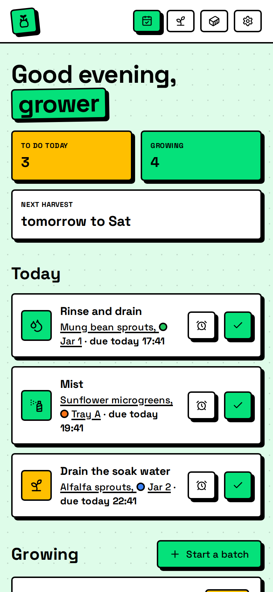
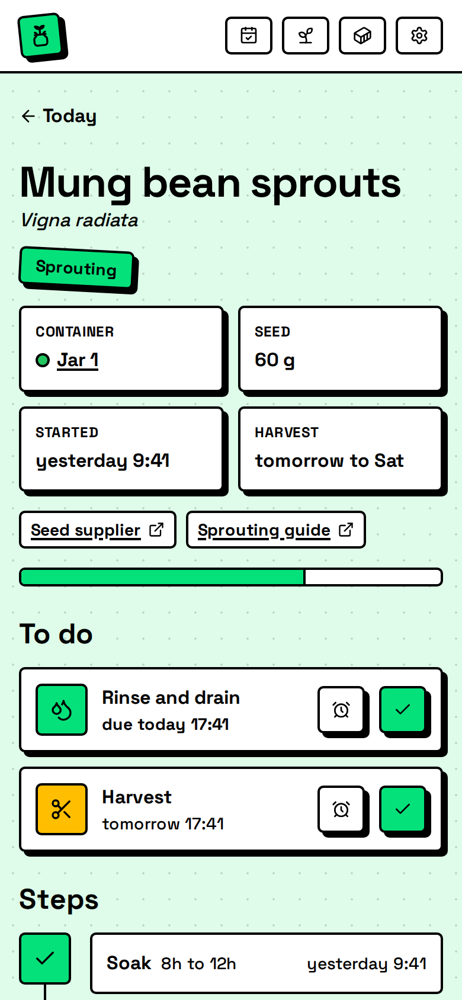
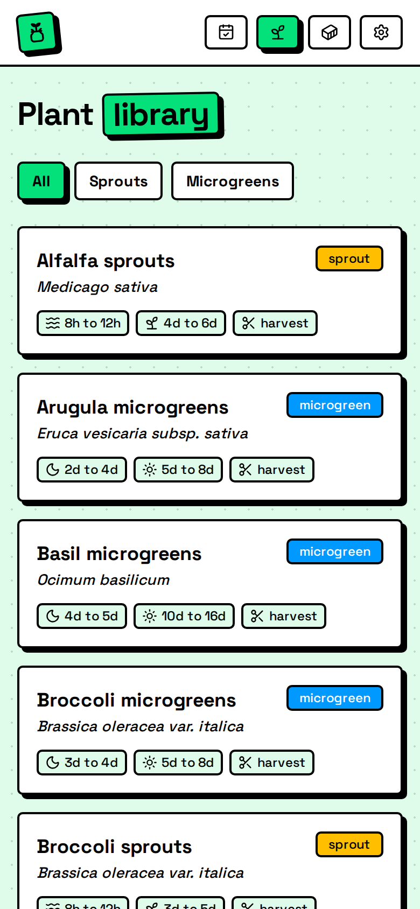
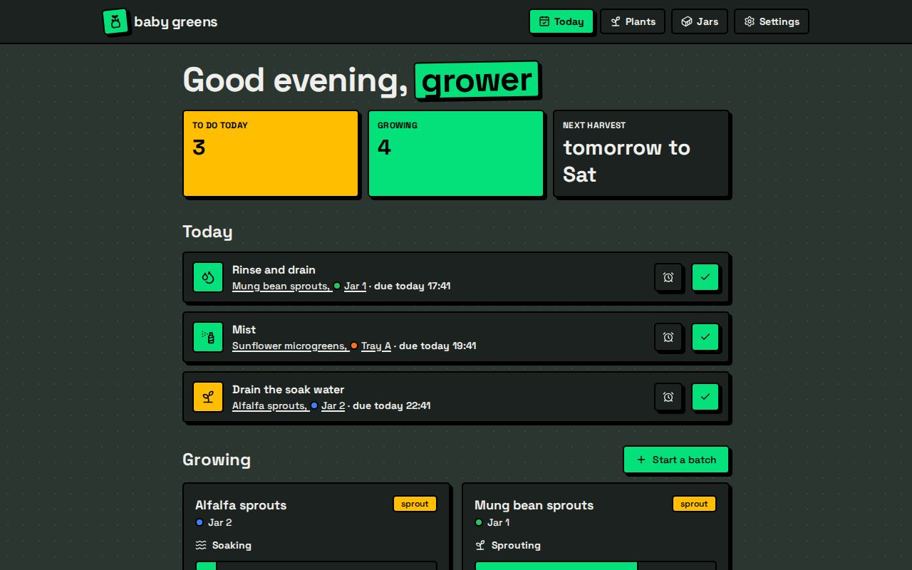

# baby-greens

 <!-- rumdl-disable-line no-inline-html -->

A tracker for sprout and microgreen batches at home. It shows what each jar or tray needs today,
sends a reminder when a task is due, and records how each batch turned out. It installs as a PWA on
desktop and phones, talks to a self-hosted Rust server, and signs you in through your own OIDC
provider.

<!-- rumdl-disable no-inline-html -->
<p>
  
  
  
</p>

<!-- rumdl-enable no-inline-html -->

## Features

- A plant library of 15 built-in plants. Each plant is a JSON definition of steps (soak, sprout,
  blackout, light, harvest) with duration ranges and repeating chores. You can add your own plants
  or override the built-in ones in the in-app editor.
- Batches with a plant, seed weight, container, and start time. You move a batch from step to step,
  and the server schedules the chores for the current step.
- A today view of everything due across all batches.
- Sharing. Everyone who can sign in sees and tends every batch, and the app shows who started each
  one.
- Web push reminders for everyone, with snoozing and quiet hours per person.
- A harvest log with yield in grams, a 1 to 5 rating, and notes, plus the yield ratio per plant.
- Offline use. The app keeps the last data it loaded, queues changes, and sends them when you're
  back online.

Growing for sale, orders, and customers are out of scope.

## Running it

CI publishes the image to `ghcr.io/flyinpancake/baby-greens` from `main` and `v*` tags. The server
needs Postgres 18, an OIDC provider, and a reverse proxy that serves it over HTTPS, since service
workers and push only work over HTTPS. [docs/deploy.md](docs/deploy.md) walks through it with
Authentik, including the optional nightly backups.

## Status

The MVP is done. [docs/roadmap.md](docs/roadmap.md) lists what might come next: API tokens, a Home
Assistant bridge over MQTT, a native app, batch photos, and seed inventory.
[docs/design.md](docs/design.md) describes how the app works.

## Layout

- `server/` is the Axum API. It uses SQLx with Postgres and applies migrations from
  `server/migrations/` on startup.
- `server/plants/builtin.json` is the built-in plant library. The "Plant definitions" section of
  [docs/design.md](docs/design.md) describes the format.
- `web/` is the React PWA, built with Vite, TanStack Router, TanStack Query, and Tailwind.
- `compose.yaml` runs Postgres 18 and Dex for development.
- `Dockerfile` builds the production image, and `deploy/` holds the production compose file. See
  [docs/deploy.md](docs/deploy.md).
- `.github/workflows/ci.yml` runs the checks, the server tests, and the browser tests, then
  publishes the image to GHCR from `main`.
- `dev/dex.yaml.tpl` configures Dex as a stand-in OIDC provider. Dex fills in the issuer and
  redirect URI from the environment.

## Development

You need Rust, Docker, and [mise](https://mise.jdx.dev). mise installs bun, watchexec, and sqlx-cli
at the versions in `mise.toml`, loads `.env`, and runs the project tasks.

```sh
mise install
cp .env.example .env
mise run up        # Postgres on :5432, Dex on :5556
mise run install   # frontend dependencies
```

Then start both dev servers:

```sh
mise run dev
```

This runs the API on <http://127.0.0.1:3000> and the app on <http://localhost:5173>. Vite proxies
`/api` and `/auth` to the API. Vite hot-reloads frontend changes. `mise watch` rebuilds and restarts
the API when anything in `server/src`, `server/migrations`, the Cargo files, or `.env` changes.

To run one half on its own, use `mise run dev:server` (restarting) or `mise run server` (single
run), and `mise run web`.

The API docs are at <http://localhost:5173/api/v1/docs>. After changing an API handler or type, run
`mise run api:gen` to update `server/openapi.json` and the frontend's generated types.

### Testing on a phone

`mise run dev:tailnet` runs the same stack on this machine's Tailscale name instead of localhost.
Open `http://<machine>.<tailnet>.ts.net:5173` on any device in your tailnet. Vite listens on the
Tailscale address and proxies the API, which stays on 127.0.0.1. Dex listens on the Tailscale
address too, because login redirects the browser to it. `mise.tailnet.toml` reads the name and
address from `tailscale` and sets `PUBLIC_URL` and `OIDC_ISSUER_URL` to match.

In this mode `localhost:5173` doesn't answer, and the browser tests, which use localhost, won't
pass. Run `mise run up` to move Dex back to localhost before plain `mise run dev`. Service workers
and push need HTTPS, so installing the app and getting reminders on a phone needs an HTTPS
deployment. This setup is plain HTTP.

`mise run serve` builds the frontend and serves it from the Rust server, the way production runs.

Browser tests live in `web/e2e`. They build the frontend and run it from the Rust server on
`localhost:3100` with push off, so editing files during a run can't interfere. They sign in through
Dex as `second@example.com` and check the main flows, plus that no page scrolls sideways at desktop,
375 px, and 320 px widths. Run `mise run test:e2e:install` once to download Chromium, then
`mise run test:e2e` with Postgres and Dex up. Tests make their own plants and jars and clean up
after themselves; discarded test batches stay in the history, where every account sees them.

Reminders need a VAPID key. Run `mise run vapid:key` and put the result in `.env` as
`VAPID_PRIVATE_KEY`. Without one the server runs with push off. Headless Chromium has no push
service, so the browser tests don't cover delivery; the Rust tests cover the job with a fake
notifier.

To run the browser tests against the container image instead, start it on `localhost:3100` and run
them with `E2E_EXTERNAL_SERVER=1`. `mise run image:build` builds the image as `baby-greens:local`.

`mise run screenshots` retakes the pictures at the top of this file. It fills a throwaway database
with demo jars and batches, so your dev data stays out of them. It needs Postgres and Dex up.

Run `mise tasks` to list the other tasks, such as `check`, `test`, `migrate:add`, and `db:reset`.

## Dev login

Dex has two test users, `grower@example.com` and `second@example.com`. Both use the password
`password`. The server runs OIDC discovery against `OIDC_ISSUER_URL` at startup, so start Dex with
`mise run up` before the server.

To use another provider, register a confidential client with the redirect URI
`<PUBLIC_URL>/auth/callback` and set the `OIDC_*` variables in `.env`.

## Versions

- sqlx stays on 0.8 because `tower-sessions-sqlx-store` 0.15 requires it. Upgrade both together.
- The schema uses `uuidv7()`, which needs Postgres 18 or newer.
- Queries use the `sqlx::query!` macros. After changing a query, run `mise run sqlx:prepare` and
  commit `server/.sqlx`, so builds without a database (CI, Docker) keep working.
